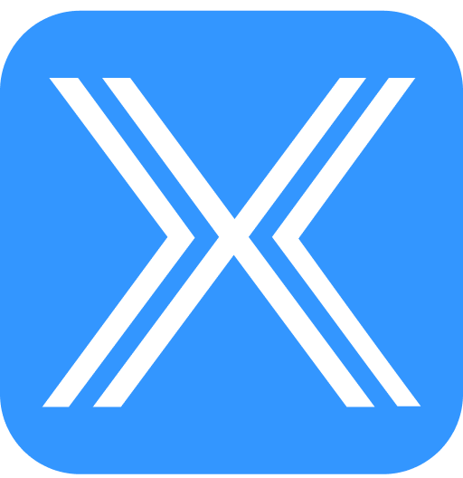

# 

# FinWhaleX Smart Contracts
Smart contract for FinWhaleX PTE LTD Token

Mainnet address: 

# Initial parameters
File .env must contain parameters
 
NAME="FinWhaleX"

SYMBOL="FWX"

EMISSION=1000000000

OWNER="Owner Address"

OWNER_MNEMONIC=""

INFURA="Infura API key"

OWNER_SEED_WALLET="wallet owner"

AMOUNT_SEED_WALLET=amount tokens

UNLOCKDATE_SEED_WALLET="Unlock dates in timestamp format, comma separated"

UNLOCKAMOUNT_SEED_WALLET="Unlock amounts, comma separated"

OWNER_PRIVATE_WALLET=""

AMOUNT_PRIVATE_WALLET=

UNLOCKDATE_PRIVATE_WALLET=""

UNLOCKAMOUNT_PRIVATE_WALLET=""

OWNER_PUBLIC_WALLET=""

AMOUNT_PUBLIC_WALLET=

UNLOCKDATE_PUBLIC_WALLET=""

UNLOCKAMOUNT_PUBLIC_WALLET=""

OWNER_TEAM_WALLET=""

AMOUNT_TEAM_WALLET=

UNLOCKDATE_TEAM_WALLET=""

UNLOCKAMOUNT_TEAM_WALLET=""

OWNER_MARKETING_WALLET=""

AMOUNT_MARKETING_WALLET=

UNLOCKDATE_MARKETING_WALLET=""

UNLOCKAMOUNT_MARKETING_WALLET=""

OWNER_RESERVE_WALLET=""

AMOUNT_RESERVE_WALLET=

UNLOCKDATE_RESERVE_WALLET=""

UNLOCKAMOUNT_RESERVE_WALLET=""
